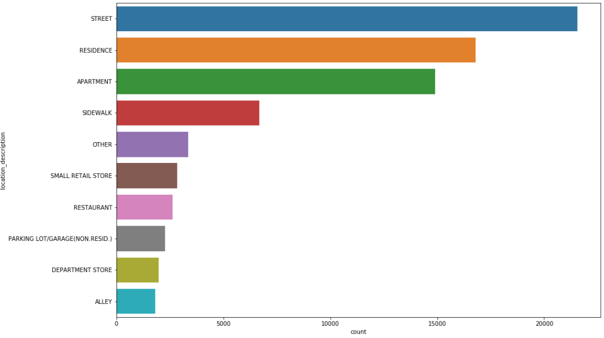

# City of Chicago crime data visualization

Authors:  **Yeshwanth Badineni**, **Akhil Singh**, **Manish katiki**, and **Mothi Kopparla**

---

## Introduction
- *The code that is being imported is of 'json'(Java Script Object Notation) format.* 
- *Data is taken from [Chicago Data Portal](https://data.cityofchicago.org/Public-Safety/Crimes-2001-to-present-Dashboard/5cd6-ry5g).*  
- *This dataset reflects reported incidents of crime that occurred in the City of Chicago from 2001 to present, minus the most recent seven days.*

---

## Sources
- The code retrieves data from [City of Chicago | Data Portal](https://data.cityofchicago.org/resource/ijzp-q8t2.json)

---

## Explanation of the Code

The code, `API_Chicago_Crime.ipynb`, begins by importing necessary Python packages:
```
import pandas as pd
import numpy as np
import matplotlib.pyplot as plt
import folium
import seaborn as sns
from folium.plugins import MarkerCluster
```

- *NOTE:  You may need to install folium.*

- You may do that by following the code below:
```
pip install folium

```

We then import data from the above mentioned source:
```
url = 'https://data.cityofchicago.org/resource/ijzp-q8t2.json?$limit=100000&'
df = pd.read_json(url)	
df	
```

We then clean our data from some unwanted columns present in the data as follows:
```
drop = [':@computed_region_awaf_s7ux',':@computed_region_6mkv_f3dw',':@computed_region_vrxf_vc4k',':@computed_region_bdys_3d7i',':@computed_region_43wa_7qmu',':@computed_region_rpca_8um6',':@computed_region_d9mm_jgwp',':@computed_region_d3ds_rm58']
df.drop(drop, inplace=True, axis=1)
```

we visualize the data, No.of crimes according to it's category:
```
plt.figure(figsize=(15,6))
df['primary_type'].value_counts().plot.bar()
plt.title("Crimes")
plt.show()
```

The output from this code is shown below:


---

we visualize the data, No.of crimes according to it's location:
```
plt.figure(figsize = (15, 10))
sns.countplot(y= 'location_description', data = df, order = df['location_description'].value_counts().iloc[:10].index);
```

The output from this code is shown below:



---

Plotting the communities in Chicago city :
```
for i in range(len(new_locations)):
    lat = new_locations.iloc[i][0]
    long = new_locations.iloc[i][1]
    popup_text = """Community Index : {}<br>
                Arrest : {}<br>
                Location Description : {}<br>"""
    popup_text = popup_text.format(new_locations.index[i],
                               new_locations.iloc[i][-1],
                               new_locations.iloc[i][-2]
                               )
    folium.CircleMarker(location = [lat, long], popup= popup_text, fill = True).add_to(chicago_map)
```

The output from this code is shown below:


---

Visualizing the density of crimes in communities:
```
for i in range(500):
    lat = CR_index['LocationCoord'].iloc[i][0]
    long = CR_index['LocationCoord'].iloc[i][1]
    radius = CR_index['ValueCount'].iloc[i] /5
    
    if CR_index['ValueCount'].iloc[i] >75:
        color = "#FF4500"
    else:
        color = "#008080"
    
    popup_text = """Latitude : {}<br>Longitude : {}<br>Criminal Incidents : {}<br>"""
    
    popup_text = popup_text.format(lat,long,CR_index['ValueCount'].iloc[i])
                               
    folium.CircleMarker(location = [lat, long], popup= popup_text,radius = radius, color = color, fill = True)\
    .add_to(chicago_map_crime)
```

The output from this code is shown below:


---

Assaults commited with guns by location:
```
mc = MarkerCluster()
for row in gun_Battery_df.itertuples():
    mc.add_child(folium.Marker(location=[row.latitude,  row.longitude], popup= 'gun'))
my_map1.add_child(mc)
```

The output from this code is shown below:


## How to Run the Code

1. Launch Jupyter Notebook on Anaconda.

2. Open and run `API_Chicago_Crime.ipynb` cell by cell.

Note: Uncomment the `pip install folium `, if the package is not pre-installed on the system.

3. You can interact with the maps to zoom in and zoom out.


---

## Suggestions
*We can further use predictive modeling to predict the crime at a recurring scene and can even suggest more patrolling at specific timings so as to curb crimes at a faster pace. Also studying common types of crimes commited in a location can allow police to take appropriate steps to mitigate them.*

---

## References

- https://python-visualization.github.io/folium/quickstart.html.
- https://towardsdatascience.com/data-visualization-with-python-folium-maps-a74231de9ef7
